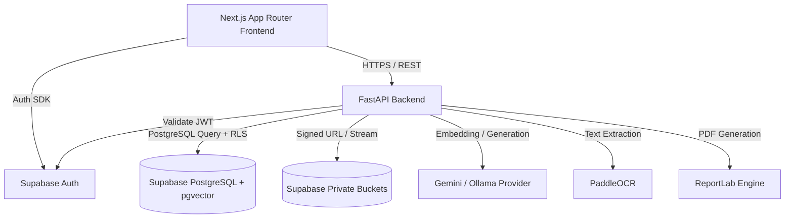

# Technical Architecture — Satya Vault

## 1. High-Level Architecture Overview

## 2. Component Subsystems

### 2.1 Frontend Subsystem (Next.js App Router)
- **Framework**: Next.js 14+ with TypeScript.
- **Styling**: Tailwind CSS adhering to restrained government design tokens.
- **Components**: Reusable ui, tables, timeline, evidence passport, and security badges.
- **Security**: Next.js middleware enforcing session existence, combined with client-side permissions hooks.

### 2.2 Backend Subsystem (FastAPI)
- **Framework**: FastAPI (Python 3.11+).
- **Authentication**: `HTTPBearer` security dependency verifying Supabase JWTs.
- **Authorization**: Custom `require_role` and `require_case_access` dependencies enforcing RBAC & ABAC.
- **Services**: Service layer decoupling business logic (hashing, audit chaining, readiness checks, report generation).

### 2.3 Database & Data Persistence (Supabase PostgreSQL)
- **Relational Tables**: `profiles`, `user_roles`, `cases`, `case_assignments`, `documents`, `document_versions`, `evidence`, `custody_events`, `audit_events`, `document_chunks`.
- **Row-Level Security (RLS)**: Enforced on every table using custom SQL helper functions (`can_access_case`, `current_user_has_role`).
- **Vector Search**: `pgvector` with cosine similarity indexes (`ivfflat`).

### 2.4 Security Subsystem & Storage
- **Private Buckets**: `documents-private`, `evidence-private`, `reports-private`.
- **Integrity**: Raw binary SHA-256 calculated before storage write.
- **Hash-Chained Audit Ledger**: Append-only log where `event_hash = SHA256(canonical(event) + previous_hash)`.
